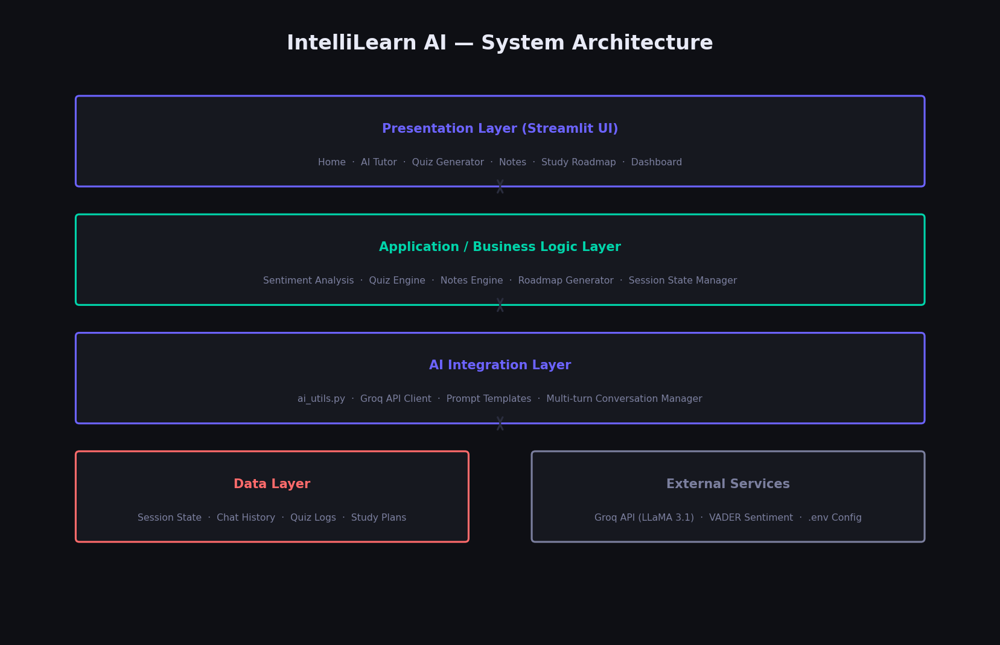
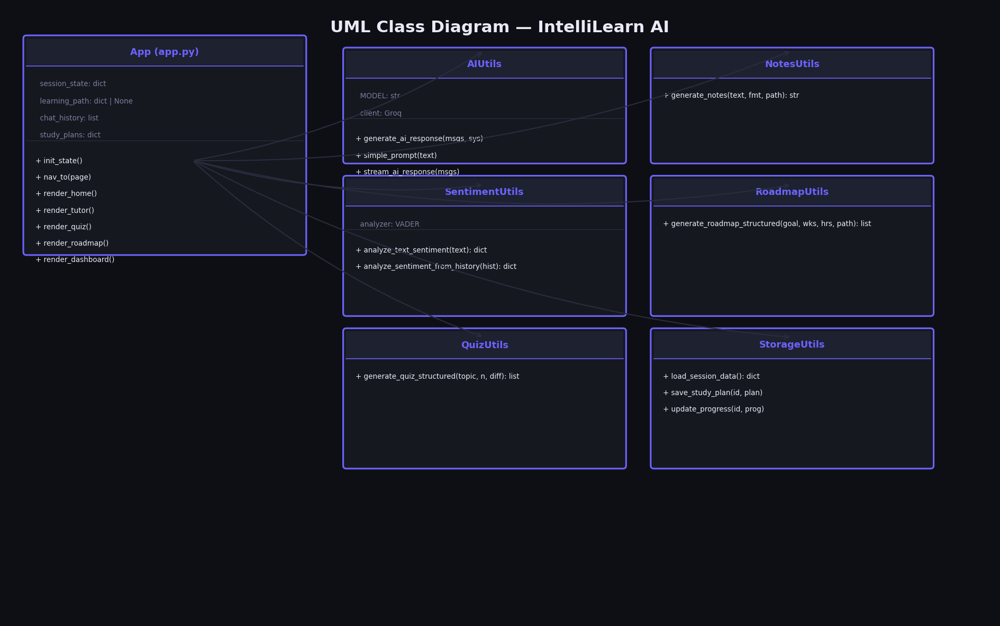
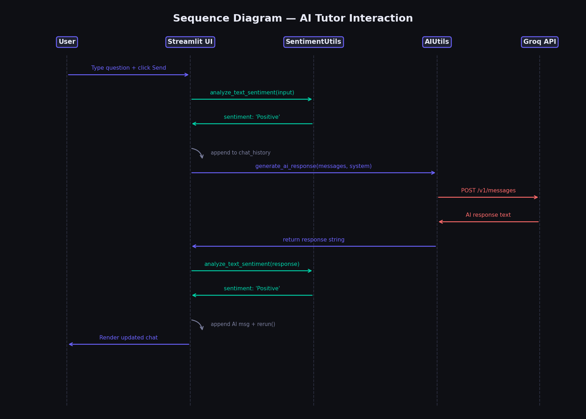
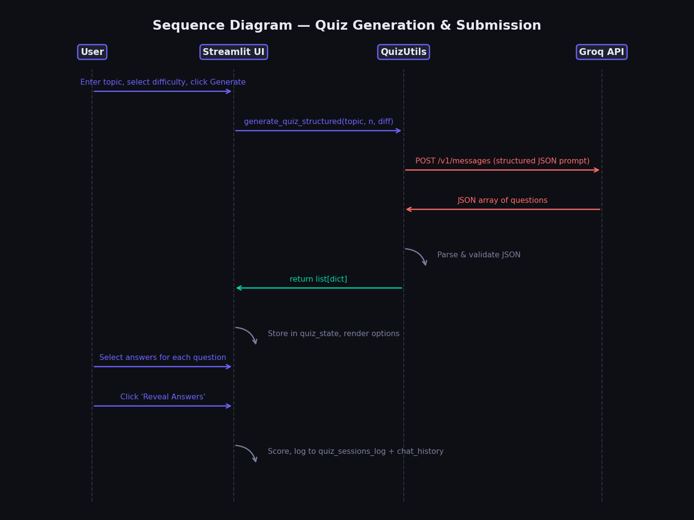
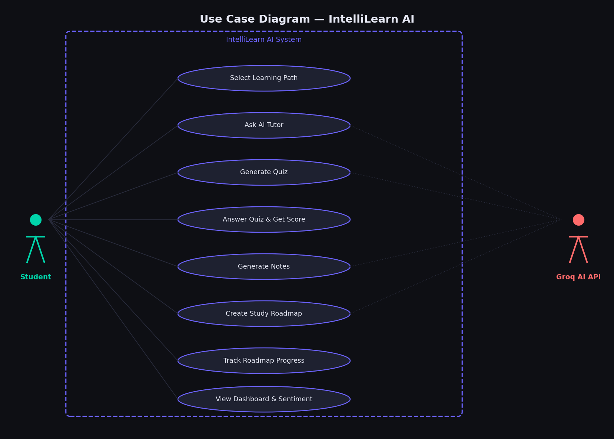
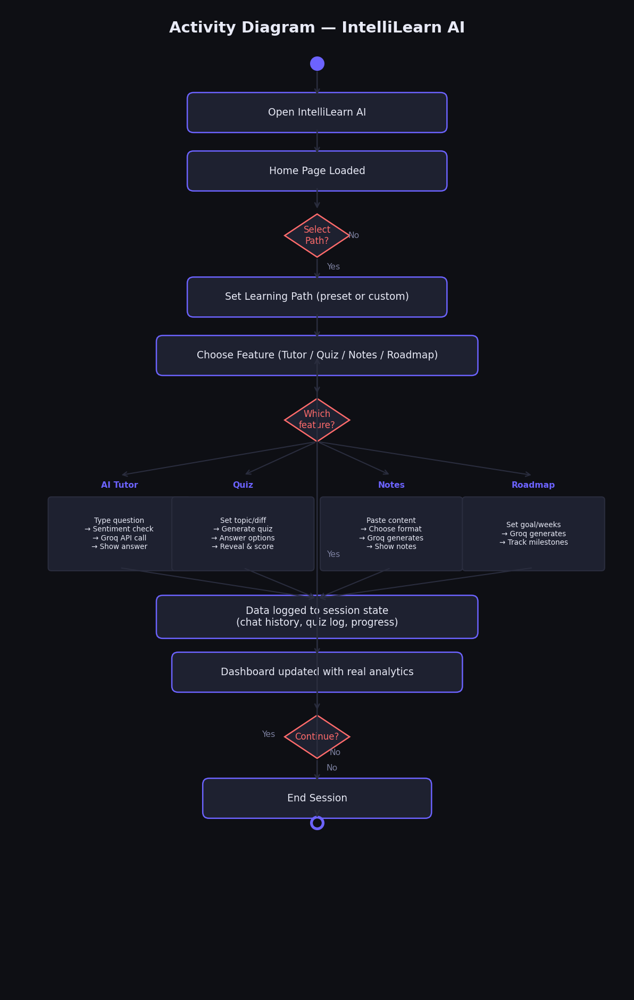
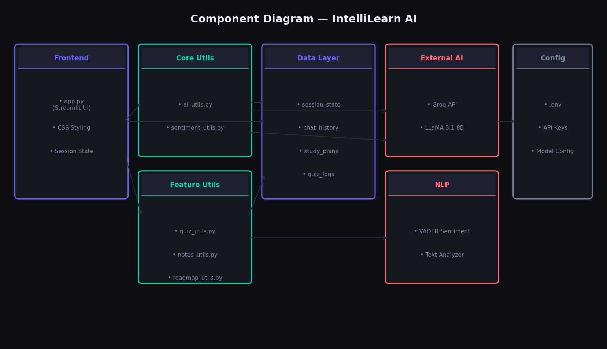

# IntelliLearn AI — Technical Documentation

**Project:** IntelliLearn AI — End-to-End AI Solution for Education  
**Bootcamp:** CAPACITI × Clickatell | 1-Month AI Bootcamp (Week 4)  
**Industry:** Education  
**Stack:** Python · Streamlit · Groq (LLaMA 3.1) · VADER Sentiment  
**Date:** April–May 2026

---

## Table of Contents

1. [Project Overview](#1-project-overview)  
2. [Week 4 Requirements Mapping](#2-week-4-requirements-mapping)  
3. [System Architecture](#3-system-architecture)  
4. [UML Class Diagram](#4-uml-class-diagram)  
5. [Sequence Diagrams](#5-sequence-diagrams)  
6. [Use Case Diagram](#6-use-case-diagram)  
7. [Activity Diagram](#7-activity-diagram)  
8. [Component Diagram](#8-component-diagram)  
9. [Feature Specification](#9-feature-specification)  
10. [AI Integration Details](#10-ai-integration-details)  
11. [Responsible AI Considerations](#11-responsible-ai-considerations)  
12. [Screenshots](#12-screenshots)  
13. [Setup & Deployment](#13-setup--deployment)  
14. [Future Enhancements](#14-future-enhancements)

---

## 1. Project Overview

IntelliLearn AI is an end-to-end AI-powered educational platform built as the Week 4 capstone for the CAPACITI AI Bootcamp. It serves students who want personalised, AI-assisted learning — offering a unified experience across tutoring, quiz generation, notes creation, study roadmapping, and learning analytics.

**Core Value Proposition:**  
Replace passive, one-size-fits-all studying with an interactive, adaptive AI companion that understands your learning mood, tracks your progress, and meets you where you are.

**Industry:** Education (EdTech)  
**Target Users:** Self-directed learners, bootcamp candidates, university students

---

## 2. Week 4 Requirements Mapping

| Week 4 Requirement | How IntelliLearn AI Satisfies It |
|---|---|
| End-to-end AI solution | Full pipeline: user input → AI processing → structured output → tracked results |
| Chosen industry | Education / EdTech |
| Functional prototype | Deployed Streamlit app with all features working end-to-end |
| AI solution architecture | Multi-layer architecture (see §3) with clear separation of concerns |
| Workflow integration | Learning path context flows across all features |
| Responsible AI considerations | Transparency, no auto-answer reveal, educational framing (see §11) |
| Real-world use case mapping | Replaces traditional study apps with an AI-native alternative |
| Portfolio documentation | This document + diagrams + README + prompt case study |

---

## 3. System Architecture



The application follows a **four-layer architecture**:

### Layer 1 — Presentation (Streamlit UI)
`app.py` renders all pages. Navigation is sidebar-driven with persistent session state. The UI is styled using embedded CSS with a dark, professional aesthetic (Sora + JetBrains Mono typefaces).

### Layer 2 — Business Logic
Feature modules handle:
- **Quiz Engine** — generates, validates, scores, and logs quiz sessions
- **Notes Engine** — formats AI-generated notes per user-selected format
- **Roadmap Generator** — produces week-by-week structured plans with milestone tracking
- **Session State Manager** — maintains chat history, study plans, quiz logs, and sentiment across the session

### Layer 3 — AI Integration
`ai_utils.py` wraps the Groq API:
- `generate_ai_response(messages, system)` — multi-turn conversation support
- `simple_prompt(text)` — single-turn internal calls (quiz, notes, roadmap generation)
- All prompts are engineered to return structured JSON where applicable

### Layer 4 — Data / External Services
- **Session State** — Streamlit's `st.session_state` persists all data within a session
- **VADER Sentiment** — analyses user messages and quiz outcomes in real-time
- **Groq API** — provides LLaMA 3.1 8B inference for all AI features
- **`.env`** — API keys loaded via `python-dotenv`

---

## 4. UML Class Diagram



### Key Classes

| Class | Responsibility |
|---|---|
| `App (app.py)` | Entry point; manages navigation, renders all pages, holds global session state |
| `AIUtils` | Wraps Groq API; handles single-turn and multi-turn AI calls |
| `SentimentUtils` | VADER-based sentiment analysis; analyses individual texts and full conversation history |
| `QuizUtils` | Generates structured JSON quizzes via AI; validates and returns question objects |
| `NotesUtils` | Converts raw content into formatted study notes (4 format types) |
| `RoadmapUtils` | Generates week-by-week JSON roadmaps; handles fallback on parse errors |
| `StorageUtils` | Abstraction layer for session state persistence (extensible to a database) |

---

## 5. Sequence Diagrams

### 5.1 AI Tutor Interaction



**Flow:**
1. User types a question and clicks Send
2. UI calls `SentimentUtils.analyze_text_sentiment()` on the input
3. User message + sentiment are appended to `chat_history`
4. `AIUtils.generate_ai_response()` is called with the last 10 messages + system prompt
5. Groq API returns the response
6. AI response sentiment is analysed and stored
7. UI re-renders the full chat thread

### 5.2 Quiz Generation & Submission



**Flow:**
1. User configures topic, difficulty, and question count
2. `QuizUtils.generate_quiz_structured()` sends a structured JSON prompt to Groq
3. Response is parsed and validated; questions stored in `quiz_state`
4. User selects answers (no correct answer shown until they choose)
5. User clicks "Reveal Answers" — score computed, logged to `quiz_sessions_log` and `chat_history` (for sentiment tracking)

---

## 6. Use Case Diagram



**Actors:**
- **Student** — the primary user interacting with all features
- **Groq AI API** — the external AI backend powering all generative features

**Use Cases:**
1. Select Learning Path (preset or custom)
2. Ask AI Tutor (multi-turn conversation)
3. Generate Quiz
4. Answer Quiz & Get Score
5. Generate Notes
6. Create Study Roadmap
7. Track Roadmap Progress (milestone checkboxes, persistent within session)
8. View Dashboard & Sentiment Analysis

---

## 7. Activity Diagram



The activity diagram shows the full user journey from opening the app to completing a feature loop. Key decision points:
- **Select Path?** — user may or may not choose a preset learning path; the system adapts contextually regardless
- **Which feature?** — user branches to any feature; all paths converge back to data logging and dashboard update
- **Continue?** — user can loop through multiple features in one session

---

## 8. Component Diagram



**Components and their interfaces:**

| Component | Provides | Requires |
|---|---|---|
| Frontend (`app.py`) | Web UI, navigation | Core Utils, Feature Utils, Data Layer |
| Core Utils | AI responses, sentiment scores | Groq API, VADER |
| Feature Utils | Quiz data, notes text, roadmap JSON | Core Utils (AI calls), Data Layer |
| Data Layer | Persistent session data | — |
| External AI (Groq) | LLM inference | Config (.env) |
| NLP (VADER) | Sentiment scores | — |

---

## 9. Feature Specification

### 9.1 Home Page
- Welcome screen with feature tile navigation (6 tiles)
- Real-time sentiment badge from conversation history
- Active learning path banner
- Learning path selector (5 presets + Custom)

### 9.2 AI Tutor
- Multi-turn conversational interface
- System prompt includes learning path context
- Per-message sentiment analysis stored with each message
- Quick-access topic chips (from active learning path)
- Chat history clear option
- All messages feed Dashboard sentiment analytics

### 9.3 Quiz Generator
- Topic, difficulty (Beginner / Intermediate / Advanced), and question count (3–10) controls
- AI generates structured JSON questions with 4 options each
- Interactive option buttons — user selects answers inline
- **Answers hidden until "Reveal Answers" button clicked**
- Per-question explanations shown after reveal
- Score computed and displayed as percentage with colour coding
- Quiz sessions logged; score events added to chat history for sentiment tracking
- Quiz history panel (last 5 sessions)

### 9.4 Notes Generator
- Paste any content (up to 4,000 characters processed)
- Four output formats: Structured Bullet Points, Summary + Key Concepts, Flashcard Q&A, Mind Map Outline
- Learning path context injected into prompt
- Notes history (last 3 sessions stored and viewable)

### 9.5 Study Roadmap
- Goal, duration (2–12 weeks), and hours-per-week inputs
- AI generates structured week objects with theme, description, milestones, mini-project, and resources
- **Milestone checkboxes** — click to mark done, persists within session
- Overall progress percentage computed from actual checked milestones
- Multiple plans supported; plan selector dropdown appears with 2+ plans
- Per-plan and cross-plan progress shown in Dashboard

### 9.6 Dashboard
- **All data is real** — no hardcoded or demo values
- Metric cards: Chat Messages, Quiz Sessions, Avg Quiz Score, Milestones Done
- Sentiment analysis section (derived from `chat_history`)
  - Overall sentiment badge + breakdown bars (Positive / Neutral / Negative)
  - Shows message when no history exists yet
- Quiz performance log with progress bars
- Study plan progress bars

---

## 10. AI Integration Details

### Model
- **Provider:** Groq  
- **Model:** `llama-3.1-8b-instant`  
- **Temperature:** 0.7 (conversational) / 0.3 (structured outputs)

### Prompt Engineering Patterns Used

| Pattern | Where Used |
|---|---|
| **System role injection** | AI Tutor — sets educational persona and learning path context |
| **Structured JSON output** | Quiz Generator, Roadmap Generator — forces parseable output |
| **Format specification** | Notes Generator — instructs specific markdown format |
| **Context window management** | AI Tutor — last 10 messages sent to maintain coherent conversation |
| **Fallback handling** | Quiz & Roadmap — graceful degradation if JSON parsing fails |

### Sentiment Integration
VADER (`vaderSentiment`) analyses:
1. Each user message in the AI Tutor (real-time, stored per message)
2. Quiz outcome messages auto-generated and stored as sentiment data points
3. Dashboard aggregates all historical entries into overall mood + breakdown

---

## 11. Responsible AI Considerations

| Concern | Mitigation |
|---|---|
| **Answer spoiling** | Quiz answers are hidden behind an explicit "Reveal Answers" button — promotes active recall |
| **AI accuracy** | Explanations provided post-reveal; users are encouraged to verify with external sources |
| **Bias in content** | Groq/LLaMA outputs monitored; learning path framing keeps responses focused |
| **Data privacy** | No data leaves the session; no user data stored on external servers |
| **Over-reliance** | Sentiment tracking surfaces if a student is struggling so they can seek additional help |
| **Transparency** | All AI-generated content is clearly labelled; the model and provider are documented |

---

## 12. Screenshots

> 📸 **Instructions for adding screenshots:**  
> Run `streamlit run app.py`, navigate to each page, and save screenshots as the filenames listed below into `docs/images/`.

| Filename | Content |
|---|---|
| `screenshot_home.png` | Home page with feature tiles and learning path selector |
| `screenshot_tutor.png` | AI Tutor with a conversation in progress |
| `screenshot_quiz_answering.png` | Quiz with user answering (answers hidden) |
| `screenshot_quiz_revealed.png` | Quiz after "Reveal Answers" with score shown |
| `screenshot_notes.png` | Notes Generator output |
| `screenshot_roadmap.png` | Study Roadmap with milestone checkboxes |
| `screenshot_dashboard.png` | Dashboard with real session data populated |

---

## 13. Setup & Deployment

### Prerequisites
- Python 3.9+
- A free [Groq API key](https://console.groq.com)

### Installation

```bash
# Clone / download the project
cd intellilearn-ai

# Install dependencies
pip install -r requirements.txt

# Configure environment
cp .env.example .env
# Edit .env and add your GROQ_API_KEY

# Run the app
streamlit run app.py
```

### Project Structure

```
intellilearn-ai/
├── app.py                    # Main application entry point
├── requirements.txt
├── .env.example
├── utils/
│   ├── ai_utils.py           # Groq API wrapper (multi-turn + simple)
│   ├── sentiment_utils.py    # VADER sentiment analysis
│   ├── quiz_utils.py         # Structured quiz generation
│   ├── notes_utils.py        # Notes generation (4 formats)
│   ├── roadmap_utils.py      # Week-by-week roadmap generation
│   └── storage_utils.py      # Session persistence abstraction
└── docs/
    ├── technical_documentation.md   (this file)
    ├── prompt_case_study.md
    ├── architecture.md
    └── images/
        ├── architecture_diagram.png
        ├── uml_class_diagram.png
        ├── sequence_diagram_tutor.png
        ├── sequence_diagram_quiz.png
        ├── use_case_diagram.png
        ├── activity_diagram.png
        ├── component_diagram.png
        └── screenshot_*.png          (add manually)
```

---

## 14. Future Enhancements

| Enhancement | Description |
|---|---|
| **Persistent storage** | Swap `session_state` for SQLite or Supabase so data survives page refreshes |
| **User accounts** | Multi-user support with individual progress histories |
| **Adaptive quizzes** | Adjust question difficulty based on rolling quiz performance |
| **Spaced repetition** | Surface flashcards based on forgetting curves derived from quiz scores |
| **PDF/URL ingestion** | Let users paste a URL or upload a PDF for Notes and Roadmap generation |
| **Progress certificates** | Auto-generate PDF certificates when a study plan is 100% complete |
| **Mobile app** | Wrap the Streamlit app in a Progressive Web App shell |
